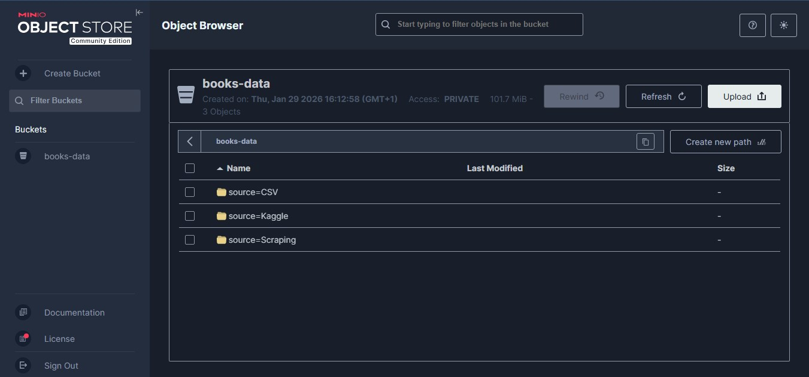

# 📚 Books ETL Pipeline with Airflow and MinIO - Africa TechUp Tour Project

## 📌 Project Overview

This project implements an end-to-end **ETL (Extract – Transform – Load)** pipeline for books data collected from multiple heterogeneous sources.  
The pipeline is orchestrated using **Apache Airflow**, containerized with **Docker**, and the final consolidated dataset is stored in **MinIO**, an S3-compatible object storage system, with partitioning.

The objective of this project is to demonstrate core **Data Engineering concepts**, including:
- Multi-source data extraction
- Data normalization and consolidation
- Workflow orchestration
- Object storage and partitioning
- Reproducible infrastructure using Docker

---

## 📊 Data Sources

The pipeline extracts books data from **three distinct sources**:

### 1. Web Scraping
- Website: https://books.toscrape.com
- Method: `requests` + `BeautifulSoup`
- Extracted fields include:
  - Title
  - Description
  - Price
  - Stock availability
  - Image URL
  - UPC

### 2. CSV File (Google Drive)
- Source: A CSV file downloaded from Google Drive
- Fields include:
  - Title
  - Author
  - Publisher
  - Year Published
  - Image URLs

### 3. Kaggle Dataset
- Dataset: `elvinrustam/books-dataset`
- Downloaded using `kagglehub`
- Fields include:
  - Title
  - Author
  - Description
  - Publisher
  - Year
  - Price

---

## 🔄 ETL Pipeline Architecture

### Extract
Each data source is extracted independently:
- Scraping is handled via HTTP requests and HTML parsing
- CSV and Kaggle data are read using Python’s CSV utilities
- Each extraction produces a clean intermediate CSV file

### Transform
- Column names are normalized
- Missing fields are handled with `NULL` values
- All datasets are aligned to a **canonical schema**
- A `Source` column is added to track data provenance

### Load
- The consolidated dataset is written to a final CSV file
- Data is uploaded to **MinIO**
- Data is **partitioned by source**, simulating a data lake architecture

---

## 🗂️ Data Partitioning Strategy

Partitioning is performed on the `Source` column.

MinIO bucket structure:

```text
books-data/
├── source=Scraping/
│   └── books_scraping.csv
├── source=CSV/
│   └── books_csv.csv
└── source=Kaggle/
    └── books_kaggle.csv
```

This approach improves:
- Data organization
- Scalability
- Query efficiency in analytical workloads

---

## ⚙️ Workflow Orchestration with Airflow

Apache Airflow is used to orchestrate the pipeline.

### DAG Tasks
1. Extract books from website (scraping)
2. Extract books from Google Drive CSV
3. Extract books from Kaggle dataset
4. Consolidate all extracted datasets
5. Load partitioned data into MinIO

Extraction tasks run **in parallel**, followed by consolidation and loading.

---

## 🐳 Infrastructure

- Docker is used to containerize:
  - Apache Airflow
  - MinIO
- All dependencies are baked into the Docker image
- Airflow runs in `standalone` mode for simplicity

---

## 📸 Screenshots

### Airflow DAG Execution
> *(Airflow GUI screenshot)*


### MinIO Bucket and Partitions
> *(MinIO GUI screenshot)*



---

## ✅ Technologies Used

- Python 3
- Apache Airflow
- Docker & Docker Compose
- MinIO (S3-compatible storage)
- BeautifulSoup
- Requests
- KaggleHub

---

## 🏁 Conclusion

This project demonstrates a complete ETL pipeline following data engineering best practices.  
It highlights the use of workflow orchestration, object storage, and partitioning to build a scalable and maintainable data pipeline.

The architecture can be extended to support:
- Parquet format
- Date-based partitions
- Data quality checks
- Cloud object storage (AWS S3, GCP, Azure)

---

## 👤 Project Author

**Deogracias Adanlokonon**  
Data Engineering Student || Senior Python Backend Developer  

📧 Email: adanlokonondeogracias1@gmail.com  
🔗 LinkedIn: https://www.linkedin.com/in/deograciasadanlokonon/

---

*This project was built as part of the Africa TechUp Tour ETL assignment to demonstrate data engineering concepts such as orchestration, data consolidation, and object storage with partitioning.*
